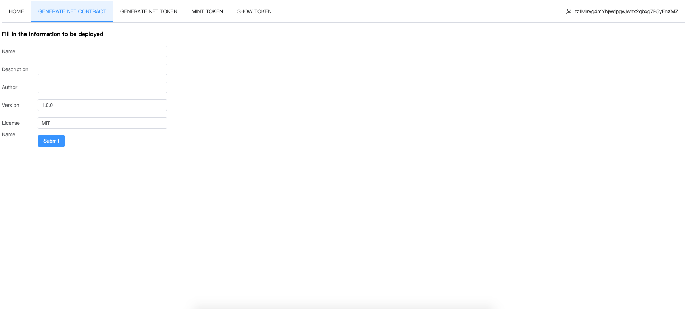
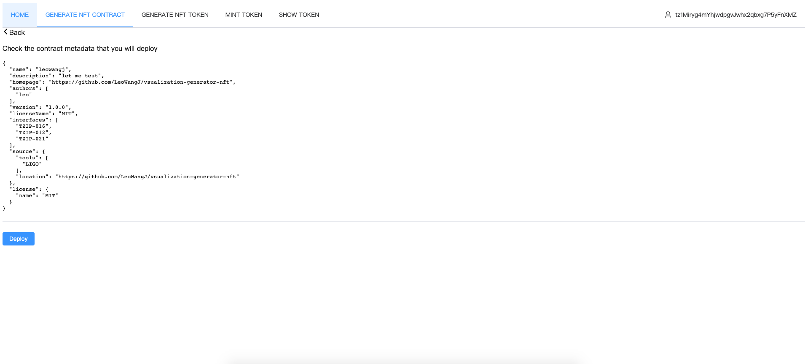
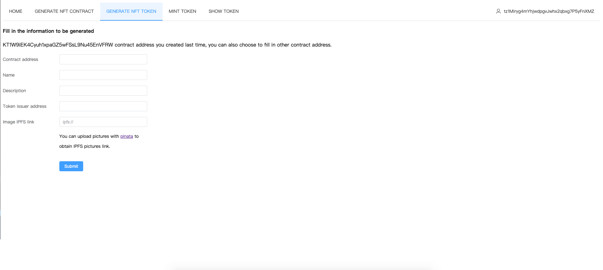
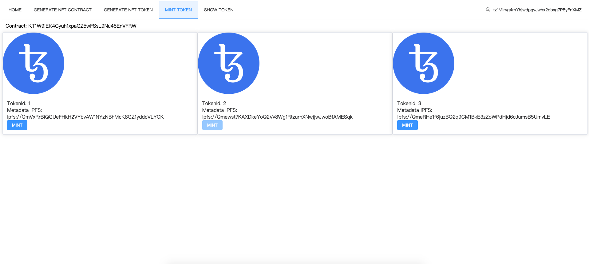
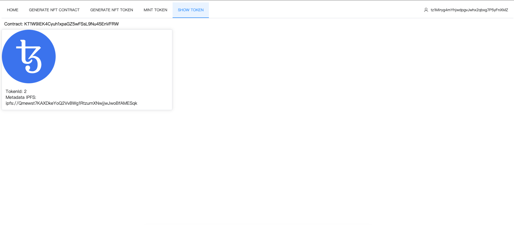

# Project Name

vsualization-generator-nft

# Project description
 This website uses [TZNFT CLI](https://github.com/oxheadalpha/nft-tutorial/tree/master/packages/tznft) to develop visualized production of NFT pages, which is convenient for users who do not write programs to generate the NFT they want more conveniently.

 - This website provides:
    1. generating NFT contracts
    2. generating NFT token
    3. mint NFT token
    4. show your mint NFT token

Currently we only use Temple Wallet and Ghostnet Testnet.

The website will continue to optimize ..., Please wait for our good news
    
# Project run
```
pnpm install 
pnpm dev
```

# Project requirements
 - Node v16.14.0
# Working App

Website - [https://leowangj.github.io/vsualization-generator-nft](https://leowangj.github.io/vsualization-generator-nft)

# Demo by Picture 
- Input information for deploy nft contract 



- Show nft contract metadata and deploy 



- Input information for nft token



- Show your deployment nft token & can mint it



- Show you have nft token



# Team
[leowang](https://github.com/LeoWangJ)
# Contact Info

- Discord ID - leoJ#5012
- Email ID - [rfv7855659@gmail.com](mailto:rfv7855659@gmail.com)
- Gitcoin - [leowangj](https://gitcoin.co/leowangj)
